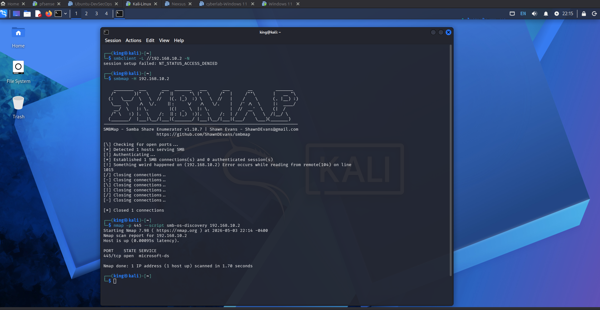
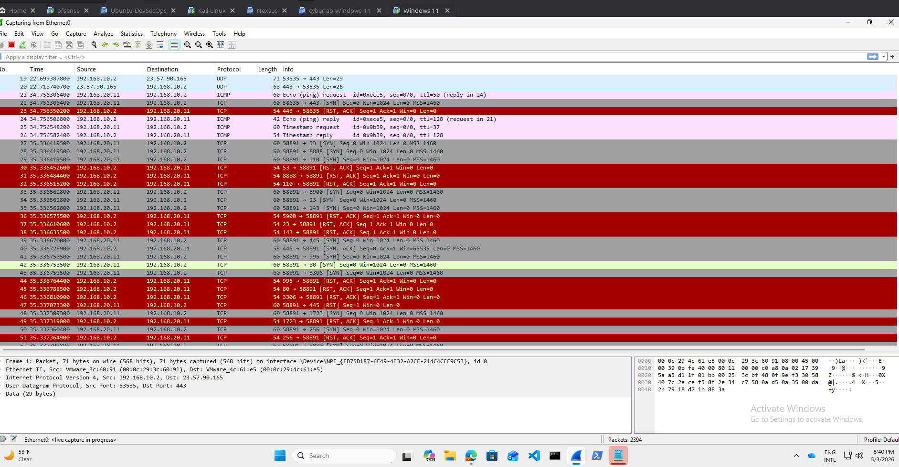
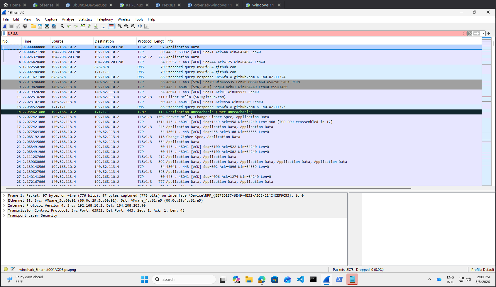
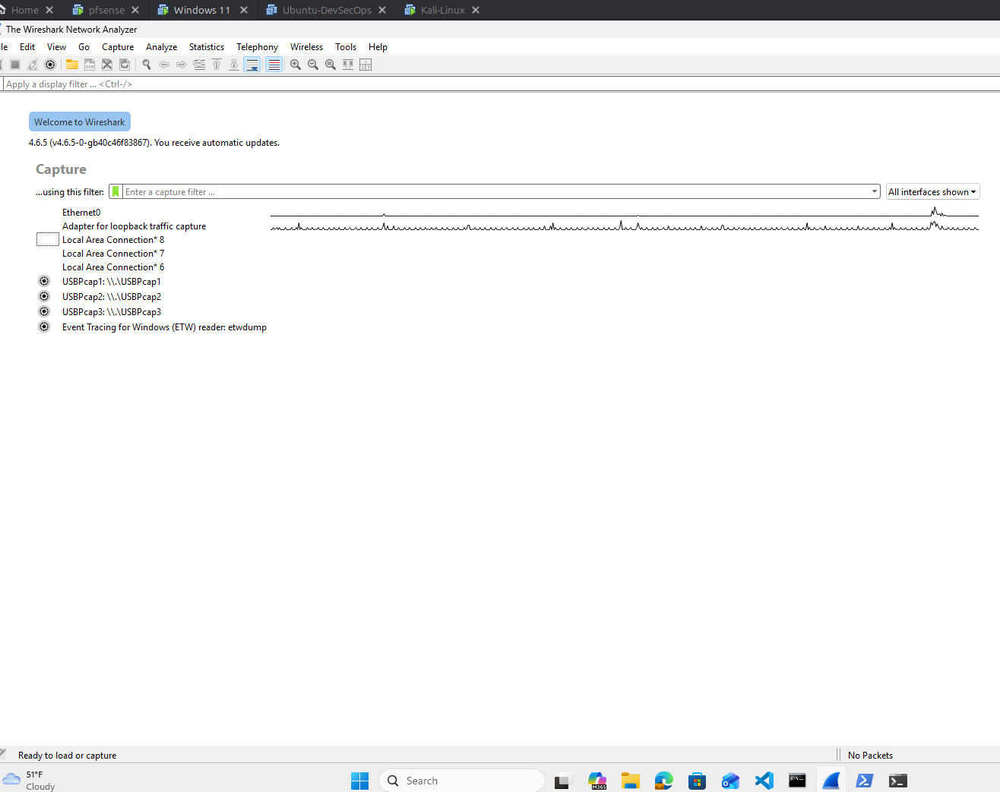
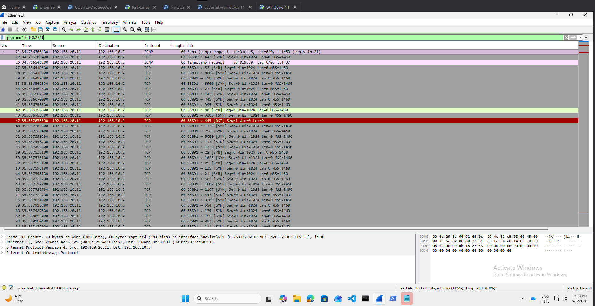

# 🛡️ Network Threat Detection & Packet Analysis Lab

## 📌 Overview

This project simulates real-world attacker reconnaissance and service enumeration within a segmented lab environment. Network traffic was captured and analyzed using Wireshark to identify malicious behavior and validate defensive controls.

---

## 🧪 Lab Environment

* **Firewall:** pfSense (Network Segmentation)
* **Attacker Machine:** Kali Linux
* **Target Machine:** Windows 11
* **Tools Used:** Wireshark, Nmap, SMBclient

---

## 🚨 Attack Simulation

The attacker performed:

* SYN-based port scanning
* Service enumeration
* SMB enumeration attempts

Traffic was captured and analyzed to identify patterns associated with reconnaissance activity.

---

## 🔍 Key Findings

* Multiple ports probed across the target system
* Port **445 (SMB)** confirmed open
* RST/ACK responses observed on closed ports
* SMB enumeration attempts detected
* Anonymous and guest access denied

---

## 🛡️ Detection Strategy

* Monitor abnormal SYN packet spikes
* Detect multi-port scanning patterns
* Identify repeated SMB enumeration attempts
* Correlate attacker IP across multiple services
* Use packet filtering to isolate malicious traffic

---

## 🔐 Mitigation

* Restrict SMB access (port 445)
* Disable guest/anonymous authentication
* Implement network segmentation (pfSense)
* Monitor network traffic for scanning behavior
* Enforce authentication controls

---

## 📊 Packet Analysis Evidence

### 🔹 Wireshark Capture Initialization
Wireshark configured to capture traffic on the active interface.

---

### 🔹 Baseline Network Traffic (Normal Activity)
Normal DNS, TCP handshake, and HTTPS traffic observed.

---

### 🔹 Nmap SYN Scan – Service Discovery
TCP SYN scan identifies open ports on the target.

---

### 🔹 SYN Scan Activity Observed in Wireshark
Attacker scanning target; closed ports return RST/ACK, port 445 open.

---

### 🔹 Filtered SYN Packets (Port Scanning Evidence)
Filter:tcp.flags.syn == 1 && tcp.flags.ack == 0

---

### 🔹 Attacker Source Traffic Analysis
Filter:p.src == 192.168.20.11

---

### 🔹 SMB Enumeration Attempts with Access Denied
SMB enumeration attempts failed due to authentication controls.

---

## 📁 Project Structure

wireshark-threat-detection-lab/
│
├── README.md
├── screenshots/
├── report/
│   ├── wireshark-lab-report.pdf
│   └── wireshark-lab-report.docx
├── pcap/
├── queries/

---

## 🎯 MITRE ATT&CK Mapping

* **Reconnaissance:** Active Scanning (T1595)
* **Discovery:** Network Service Discovery (T1046)
* **Lateral Movement (Attempted):** SMB/Windows Admin Shares (T1021.002)

---

## 🎯 Conclusion

This lab successfully demonstrates how reconnaissance and enumeration activities appear in network traffic and how defensive controls such as authentication enforcement and segmentation reduce attack success.

---

## 👤 Author

**Chinedu Kingsley Asuzu**
Cybersecurity Analyst | SOC | Cloud Security Engineer

