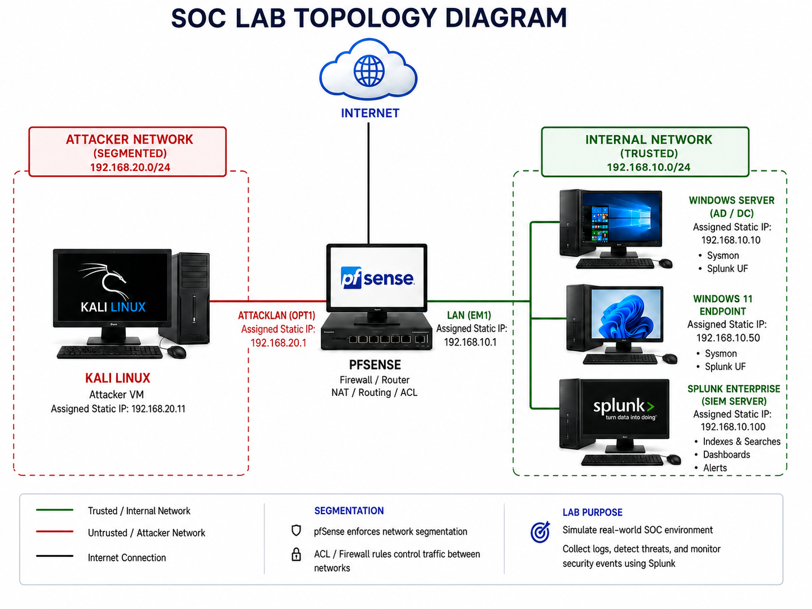

<div align="center">

# 🛡️ Wireshark Network Threat Detection Lab


**I simulated real-world attacker reconnaissance and SMB enumeration in a segmented VMware lab, captured the full attack traffic in Wireshark, and documented how each attack pattern appears at the packet level — producing evidence-backed detection logic a SOC analyst would use in a live investigation.**

[Overview](#-overview) • [Architecture](#-architecture) • [Environment](#-lab-environment) • [Attack Simulation](#-attack-simulation) • [Packet Evidence](#-packet-analysis-evidence) • [Detection](#-detection-logic) • [MITRE](#-mitre-attck-mapping) • [Skills](#-skills-demonstrated)

</div>

---

## 📋 Lab Summary

| Field | Detail |
|---|---|
| **Certification Alignment** | CompTIA Security+ · CySA+ · Network+ |
| **Estimated Time** | 3–5 hours |
| **Estimated Cost** | $0 — all open source tools |
| **Difficulty** | Intermediate |
| **Environment** | VMware · pfSense · Kali Linux · Windows 11 |
| **Career Relevance** | SOC Analyst T1–T3 · Network Security Engineer · Incident Responder |

---

## 🎯 Overview

This lab replicates the early stages of a network intrusion — reconnaissance and enumeration — in a fully segmented VMware environment. The goal was to observe and document exactly what attacker traffic looks like at the packet level, so that detection logic can be built from real evidence rather than theory.

The attack chain covered:
- **SYN-based port scanning** with Nmap to enumerate open services on the target
- **SMB enumeration** via SMBclient targeting port 445 on Windows 11
- **Wireshark packet capture and analysis** to identify each attack pattern in real traffic
- **pfSense firewall segmentation** enforcing network boundaries between attacker and target

> Every detection pattern documented here is derived from live packet captures — not simulated output. This is how real SOC investigation workflows operate: evidence first, conclusions second.

---

## 🏗 Architecture

### Network Topology Diagram



### Network Segments

| Segment | Subnet | Host | Role |
|---|---|---|---|
| **Attacker Network** | 192.168.20.0/24 | Kali Linux (192.168.20.11) | Attack source — Nmap, SMBclient |
| **Target Network** | 192.168.10.0/24 | Windows 11 | Scan target — Port 445 open |
| **Management** | Internal | Splunk SIEM | Log collection and correlation |
| **Firewall** | All segments | pfSense | Routing and segmentation enforcement |

---

## 🖥 Lab Environment

| Component | Detail |
|---|---|
| **Virtualisation** | VMware Workstation |
| **Firewall / Router** | pfSense — enforces segmentation between all network zones |
| **Attacker VM** | Kali Linux — attack tools: Nmap, SMBclient, Wireshark |
| **Target VM** | Windows 11 — Port 445 (SMB) open, anonymous access disabled |
| **SIEM** | Splunk — Windows Event Log collection and correlation |
| **Capture Tool** | Wireshark — full packet capture on attacker interface |

---

## 🚨 Attack Simulation

Two attack techniques were executed from the Kali Linux VM against the Windows 11 target. All traffic was captured simultaneously in Wireshark on the attacker network interface.

### Phase 1 — SYN Port Scan (Nmap)

A TCP SYN scan was launched from Kali (192.168.20.11) against the Windows 11 target to identify open services. SYN scanning sends a SYN packet to each port and observes the response — a SYN-ACK indicates the port is open, RST-ACK indicates it is closed. The scan never completes the full TCP handshake, making it faster and quieter than a full connect scan — though still clearly visible in Wireshark.

```bash
nmap -sS -p 1-1024 192.168.10.x
```

**What the network reveals:**
- High-volume SYN packets from a single source IP across many destination ports in rapid succession
- RST-ACK responses from closed ports
- SYN-ACK from port 445, confirming SMB is open

### Phase 2 — SMB Enumeration (SMBclient)

Following port discovery, SMBclient was used to attempt enumeration of SMB shares on the target. Authentication controls on the Windows 11 VM — specifically the disabling of anonymous and guest access — blocked the enumeration. The attempt and the denial are both visible in the packet capture.

```bash
smbclient -L //192.168.10.x -N
```

**What the network reveals:**
- SMB2 negotiation packets from the attacker
- Authentication challenge from the Windows 11 target
- Access denied response — guest and anonymous authentication blocked

---

## 🔍 Key Findings

| Finding | Evidence | Severity | SOC Action |
|---|---|---|---|
| **SYN port scan detected** | 1000+ SYN packets, single source IP, sequential ports | 🔴 High | Investigate source IP, check firewall block status |
| **Port 445 (SMB) confirmed open** | SYN-ACK response observed from target on port 445 | 🟠 Medium | Verify business justification for SMB exposure |
| **RST-ACK on closed ports** | Closed ports returning RST-ACK to scanner | 🟡 Low | Confirms scan activity — correlate with IDS alert |
| **SMB enumeration attempted** | SMB2 session setup requests from attacker IP | 🔴 High | Cross-reference with Windows Security Event ID 4625 |
| **Anonymous access denied** | Authentication failure in SMB session — access denied | 🟢 Controlled | Confirms auth controls effective — document as evidence |

---

## 📊 Packet Analysis Evidence

All captures were taken in Wireshark on the Kali Linux interface during live attack execution.

### Wireshark Capture Initialised

Wireshark configured to capture on the active network interface before launching any attack activity — ensuring all attacker-generated traffic was recorded from the first packet.


---

### Nmap SYN Scan — Service Discovery Output

Nmap SYN scan results confirming which ports responded with SYN-ACK (open) versus RST-ACK (closed) on the target system. Port 445 confirmed open.


---

### SYN Scan Activity in Wireshark — RST-ACK on Closed Ports

The raw packet capture during the SYN scan. Closed ports on the target respond with RST-ACK. This response pattern — high-volume SYN from one IP, RST-ACK responses across many ports — is the defining packet signature of a SYN scan.


---

### Filtered SYN Packets — Port Scanning Evidence Isolated

Wireshark display filter applied to isolate only SYN packets (no ACK flag) from the capture. This view shows exclusively the outbound scanner traffic, confirming the scan origin, destination, and port range targeted.

**Filter applied:**
```
tcp.flags.syn == 1 && tcp.flags.ack == 0
```


---

### Attacker Source Traffic — All Traffic from 192.168.20.11

Filter applied to show all traffic originating from the Kali Linux attacker IP. This is the first filter a SOC analyst would apply when investigating an alert tied to a specific source IP — it surfaces every packet that machine sent during the capture window.

**Filter applied:**
```
ip.src == 192.168.20.11
```


---

### SMB Enumeration Attempt — Access Denied

SMBclient session captured in Wireshark. The SMB2 negotiation is visible, followed by the authentication challenge from Windows 11 and the access denied response. Guest and anonymous authentication were disabled on the target — the enumeration was blocked at the authentication stage.


---

## 🔎 Detection Logic

These are the Wireshark display filters used during the investigation, each with the security reasoning behind it.

### SYN Scan Detection

```wireshark
tcp.flags.syn == 1 && tcp.flags.ack == 0
```
Isolates SYN-only packets. A burst of these from a single source across many destination ports in a short window is the packet-level fingerprint of a port scanner.

### Attacker IP Isolation

```wireshark
ip.src == 192.168.20.11
```
Surfaces all traffic from a known or suspected attacker IP. This is the starting point of any IP-based investigation — see everything the host sent before narrowing to specific protocols or ports.

### RST-ACK Response Analysis (Closed Ports)

```wireshark
tcp.flags.reset == 1 && tcp.flags.ack == 1
```
Shows all RST-ACK responses. When these are clustered in time and share a common destination IP, they confirm that IP is being port scanned from an external source.

### SMB Traffic Isolation

```wireshark
tcp.port == 445
```
Isolates all SMB traffic. Combined with the attacker IP filter, this pinpoints exactly what was attempted against the SMB service.

### Full Attack Session View

```wireshark
ip.addr == 192.168.20.11 && tcp.port == 445
```
Combines source IP and port to show the complete SMB enumeration session — from the initial connection attempt through authentication failure to access denied.

> These detection filters can be operationalised as SIEM detection rules in Splunk. SYN scan patterns translate directly to SPL queries against network flow data; SMB enumeration maps to Windows Security Event IDs 4624, 4625, and 5140.

---

## 🛡️ SOC Analyst Perspective

During a live incident, this activity would trigger the following investigation workflow:

**Initial alert:** IDS/SIEM fires on high-volume SYN packets from 192.168.20.11.

**Tier 1 actions:**
- Pull all traffic from the source IP in SIEM for the alert window
- Confirm port scan pattern — count of unique destination ports, timing, volume
- Check firewall logs for block/allow decisions on the source IP
- Escalate to Tier 2 with packet capture attached

**Tier 2 actions:**
- Identify which ports responded open (SYN-ACK)
- Pivot to SMB logs — check Windows Event ID 4625 (failed logon) and 5140 (network share access)
- Determine whether the attacker IP is internal or external — scope of the incident
- Assess whether any SMB authentication succeeded despite controls

**Conclusion from this capture:**
The reconnaissance was detected at the packet level. Authentication controls prevented SMB enumeration from succeeding. The attacker's IP, tool signatures, and target services are all documented in the capture — sufficient for a formal incident report.

---

## 🚧 Mitigation Applied

| Control | Implementation | Status |
|---|---|---|
| **SMB anonymous access disabled** | Guest and null session authentication blocked on Windows 11 | ✅ Enforced |
| **Network segmentation** | pfSense routing enforces boundaries between attacker and target networks | ✅ Enforced |
| **Port 445 monitored** | SMB traffic logged and visible in packet capture | ✅ Monitored |
| **Firewall rules** | pfSense configured to restrict inter-segment traffic by policy | ✅ Active |

---

## 🎯 MITRE ATT&CK Mapping

| Tactic | Technique | ID | Observed Behaviour |
|---|---|---|---|
| **Reconnaissance** | Active Scanning | [T1595](https://attack.mitre.org/techniques/T1595/) | Nmap SYN scan across 1024 ports |
| **Discovery** | Network Service Discovery | [T1046](https://attack.mitre.org/techniques/T1046/) | Port 445 identified as open via SYN-ACK |
| **Lateral Movement (Attempted)** | SMB/Windows Admin Shares | [T1021.002](https://attack.mitre.org/techniques/T1021/002/) | SMBclient enumeration — blocked by auth controls |

---

## 🧠 Skills Demonstrated

| Skill | Real-World Application |
|---|---|
| **Network packet capture and analysis** | Wireshark is the primary tool for network forensics and incident investigation in SOC environments |
| **Display filter construction** | Isolating specific traffic types from large captures is a core Tier 1 and Tier 2 analyst skill |
| **SYN scan identification** | Recognising port scan signatures at the packet level — used in IDS rule writing and alert triage |
| **SMB enumeration detection** | One of the most common lateral movement precursors — identifying it early limits attacker dwell time |
| **Network segmentation design** | pfSense configuration demonstrates understanding of trust zones and traffic boundaries |
| **MITRE ATT&CK mapping** | Mapping observed behaviour to ATT&CK framework is standard practice in threat intelligence and detection engineering |
| **Security investigation workflow** | Structured analysis from alert through packet evidence to documented findings mirrors real SOC methodology |

### Career Relevance

| Role | Application |
|---|---|
| **SOC Analyst Tier 1** | Alert triage, initial IP investigation, packet capture review |
| **SOC Analyst Tier 2–3** | Deep packet inspection, IOC extraction, detection rule development |
| **Network Security Engineer** | Firewall policy validation, traffic segmentation, protocol analysis |
| **Incident Responder** | Evidence collection, attack timeline reconstruction, scope determination |

---

## 📁 Portfolio Evidence

- Full packet captures demonstrating SYN scan and SMB enumeration patterns
- Wireshark display filters documented with security reasoning
- Key Findings table mapping evidence to severity and SOC action
- MITRE ATT&CK coverage across Reconnaissance, Discovery, and Lateral Movement
- Written investigation workflow from alert through Tier 2 analysis
- Lab report available in [PDF](report/wireshark-lab-report.pdf) and [Word](report/wireshark-lab-report.docx) formats

---

## 📁 Project Structure

```
wireshark-threat-detection-lab/
│
├── README.md
├── architecture.svg
├── screenshots/
│   ├── traffic_capture.png      — Wireshark initialised on attacker interface
│   ├── scan_overview.png        — Nmap SYN scan output confirming open ports
│   ├── rst_ack.png              — RST-ACK response pattern from closed ports
│   ├── syn_scan.png             — Filtered SYN packets (scanner traffic isolated)
│   ├── filtered_view.png        — All traffic from attacker IP 192.168.20.11
│   └── smb_enum.png             — SMB enumeration attempt and access denied
└── report/
    ├── wireshark-lab-report.pdf
    └── wireshark-lab-report.docx
```

---

## 🔗 Related Labs

| Lab | Description |
|---|---|
| **[Azure SOC Homelab — Splunk SIEM](https://github.com/kingsrule50/azure-soc-homelab)** | Splunk SIEM deployment ingesting Windows AD logs — detection rules, dashboards, and automated alerting |

---

## 📚 References

- [Wireshark Display Filter Reference](https://www.wireshark.org/docs/dfref/)
- [Nmap SYN Scan Documentation](https://nmap.org/book/synscan.html)
- [MITRE ATT&CK — T1595 Active Scanning](https://attack.mitre.org/techniques/T1595/)
- [MITRE ATT&CK — T1046 Network Service Discovery](https://attack.mitre.org/techniques/T1046/)
- [pfSense Documentation](https://docs.netgate.com/pfsense/en/latest/)
- [Microsoft — SMB Security Best Practices](https://learn.microsoft.com/en-us/windows-server/storage/file-server/smb-security)

---

<div align="center">

**Chinedu Kingsley Asuzu**
Cybersecurity Analyst · SOC · Cloud Security Engineer

*Part of a hands-on security lab series · All open-source tools · $0 cost*

</div>
